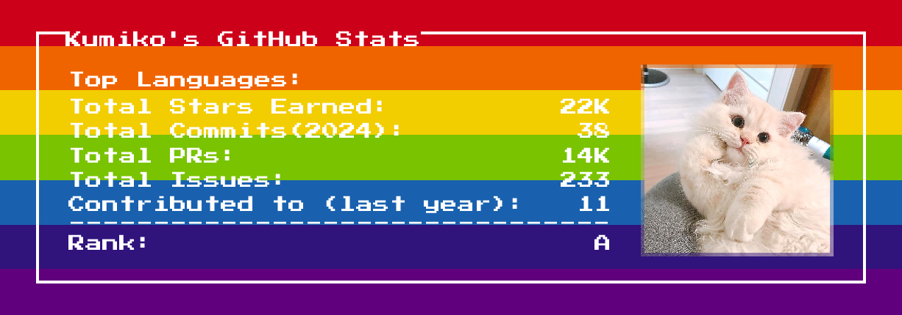
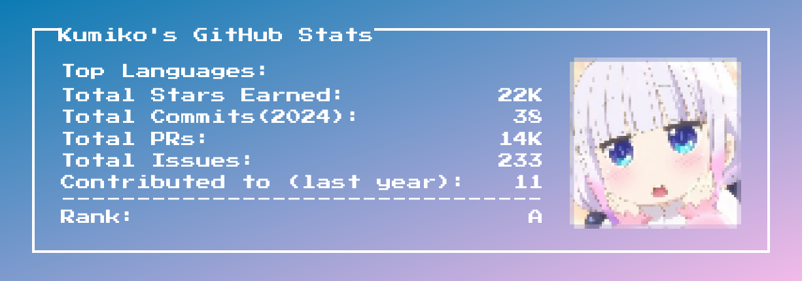
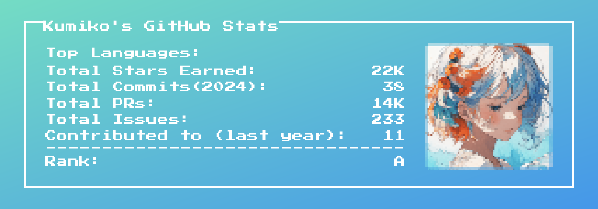

### **Goal**: 
Added the ability to display the top three most used languages in Github.
- Original Features: **Pixel Profile**: Generate pixel art profiles from your GitHub data
- before: 
- after:

### **Requirements**
- Node.js ≥ 18.17.0
- pnpm 9.7.0

- dependencies
  **- Development Tools & Build**
  typescript@5.8.3
  
  tsup@8.0.2
  
  turbo@2.0.14
  
  cross-env@7.0.3
  
  concurrently@7.6.0

  **- Linting / Formatting / Pre-hooks**
  eslint@8.57.0
  
  eslint-config-standard@17.1.0
  
  eslint-config-prettier@9.1.0
  
  eslint-plugin-prettier@5.1.3
  
  eslint-plugin-promise@6.6.0
  
  eslint-plugin-react@7.33.2
  
  eslint-plugin-node@11.1.0
  
  eslint-plugin-import@2.29.1
  
  eslint-plugin-eslint-comments@3.2.0
  
  eslint-import-resolver-typescript@2.7.1
  
  prettier@3.1.1
  
  husky@8.0.3
  
  lint-staged@15.2.0
  
  **- Server / Framework Related**
  @hono/node-server
  
  hono
  
  vercel@36.0.0
  
  **- Runtime Libraries**
  axios
  
  dotenv
  
  jimp
  
  github-username-regex
  
  satori
  
  @resvg/resvg-js
  
  **- Testing**
  vitest@3.1.2
  
  **- Utilities**
  ts-known
  
  bumpp@9.3.0

### **How to install & Run**

1. run docker image & enter container shell
  ```
  docker run -p 10277:10277 -it final_2023040017:v1
  ```

3. move to project directory
   ```
   cd ~
   ~# cd pixel-profile
   ```

4. run server
   ```
   # node --experimental-modules packages/pixel-profile-server/dist/node.js
   ```
   
   - If you encounter an error, please navigate to the following directory and install tsup:

    ```
   cd packages/pixel-profile-server  
   pnpm add -D tsup
    ```
    
   - Then, go to the project root folder and rebuild the project:
    ```
   cd pixel-profile/  
   pnpm run -r build
   node --experimental-modules packages/pixel-profile-server/dist/node.js
    ```
    
5. Enter the url below into your browser

   ```
   http://203.255.81.___:10277/api/github-stats?username=<your-github-username>&theme=lex
   ```
   (The port number is hidden for security purposes. Please enter the port number of the training server you’ve been assigned.)
   (Only HTTP is supported. Please do not use HTTPS.)

7. you can select other themes or hide stats.

#### 1. without pixelated effect

```html
http://203.255.81.___:10277/api/github-stats?username=<username>&theme=journey&pixelate_avatar=false
```
#### With dithering.
The `dithering=true` configuration is a standalone setting that can be applied to any theme.


```html
http://203.255.81.___:10277/api/github-stats?username=<username>&theme=journey&dithering=true&hide=avatar
```

#### 2. Road trip without pixelated avatar.

```html
http://203.255.81.___:10277/api/github-stats?username=<username>&theme=road_trip&pixelate_avatar=false
```

#### 3. Fuji Theme

```html
http://203.255.81.___:10277/api/github-stats?username=<username>&theme=fuji
```

#### 4. Rainbow Theme

```html
http://203.255.81.___:10277/api/github-stats?username=<username>&theme=rainbow
```

#### 5. Monica Theme

```html
https://203.255.81.___:10277/api/github-stats?username=<username>&theme=monica
```

#### 6. Summer Theme

```html
http://203.255.81.___:10277/api/github-stats?username=<username>&theme=summer
```

#### 7. Lax Theme

```html
http://203.255.81.___:10277/api/github-stats?username=<username>&theme=lax
```


### Github Stats Card Options

| Name                  | Description                                                                                                                                           | Default value |
|-----------------------|-------------------------------------------------------------------------------------------------------------------------------------------------------|---------------|
| `background`          | Set background color/image. Supports a subset of CSS background property values                                                                       | `#434343`     |
| `color`               | Set text color to any valid CSS color value                                                                                                           | `white`       |
| `hide`                | Hide specific stats or elements by passing a comma-separated list. Valid keys: 'avatar', 'commits', 'contributions', 'issues', 'prs', 'rank', 'stars' |               |
| `include_all_commits` | Count all commits                                                                                                                                     | `false`       |
| `pixelate_avatar`     | Apply pixelation to avatar                                                                                                                            | `true`        |
| `screen_effect`       | Enable curved screen effect                                                                                                                           | `false`       |
| `username`            | GitHub username                                                                                                                                       | ''            |
| `theme`               | Check out the built-in themes below                                                                                                                   | ''            |
| `dithering`           | Rendered the image using a 256-color palette with dithering                                                                                           | `false`       |


### Hiding individual stats

You can pass a query parameter `&hide=` to hide any specific stats with comma-separated values.

> Options: `&hide=avatar,commits,contributions,issues,prs,rank,stars`
```html
<!--Replace <username> with your own GitHub username.-->
https://pixel-profile.vercel.app/api/github-stats?username=<username>&hide=rank
```


### Project directory structure

```
pixel-profile/
├── action/                      # GitHub Action-related logic
│   ├── action.yml
│   ├── index.ts
│   ├── parseOutputs.ts
│   └── libs/
├── api/                         # API handler
│   └── handle.ts
├── Dockerfile                   # Docker configuration file
├── LICENSE
├── package.json                 # Root package manifest
├── pnpm-lock.yaml               # pnpm dependency lock file
├── pnpm-workspace.yaml          # pnpm workspace configuration
├── README.md
├── tsconfig.json                # TypeScript configuration
├── turbo.json                   # TurboRepo configuration
├── vercel.json                  # Vercel deployment configuration
├── vitest.config.ts             # Vitest testing configuration
├── venv/                        # (Local Python environment folder, can be deleted if unnecessary)
│
└── packages/                    # Main code packages
    ├── pixel-profile/           # Frontend / UI generation logic
    │   ├── fonts/               # Font resources
    │   ├── img/                 # Image resources
    │   ├── src/                 # Source code
    │   ├── test/                # Test code
    │   └── ...
    ├── pixel-profile-server/   # Backend API logic
    │   ├── src/
    │   └── ...
    └── utils/                   # Shared utility functions
        ├── src/
        └── ...
```

### How to finish and exit a run

 ~# Ctrl + c
 and close the browser


 License: MIT License

 
